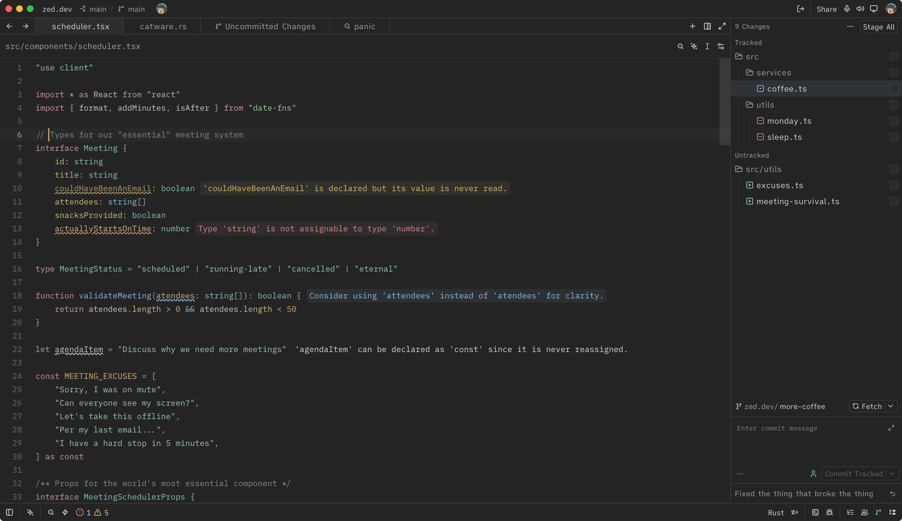

# Milo

A refined dark color theme for [Zed](https://zed.dev), with muted charcoal surfaces, a calm teal accent, and clear syntax colors for focused coding.

## Highlights

- Low-contrast dark surfaces that reduce visual noise
- Teal focus and selection accents
- Distinct, readable diagnostics and Git status colors
- Balanced terminal ANSI palette

## Use in Zed

Install **Milo** from Zed's Extensions panel, then select **Milo** from the theme picker.

## License

Released under the [MIT License](LICENSE).
